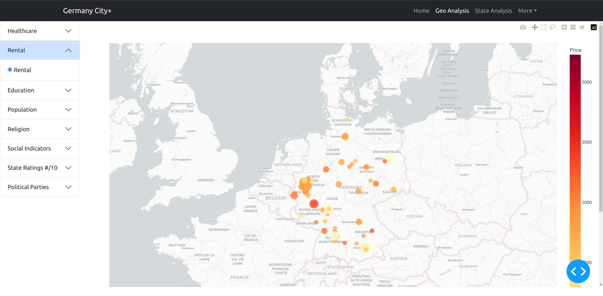
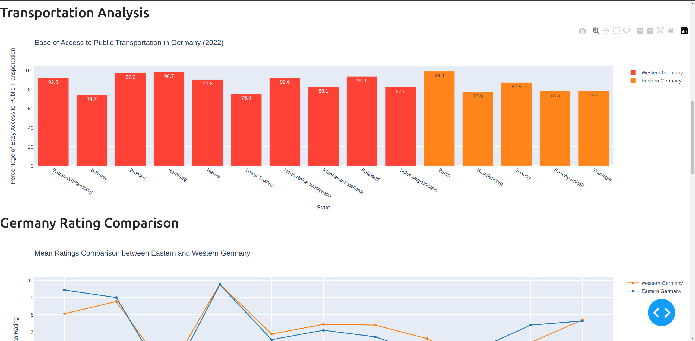
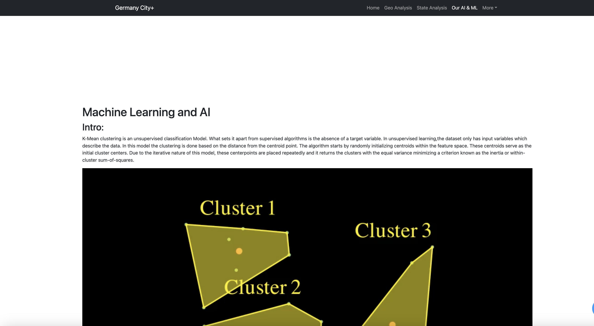
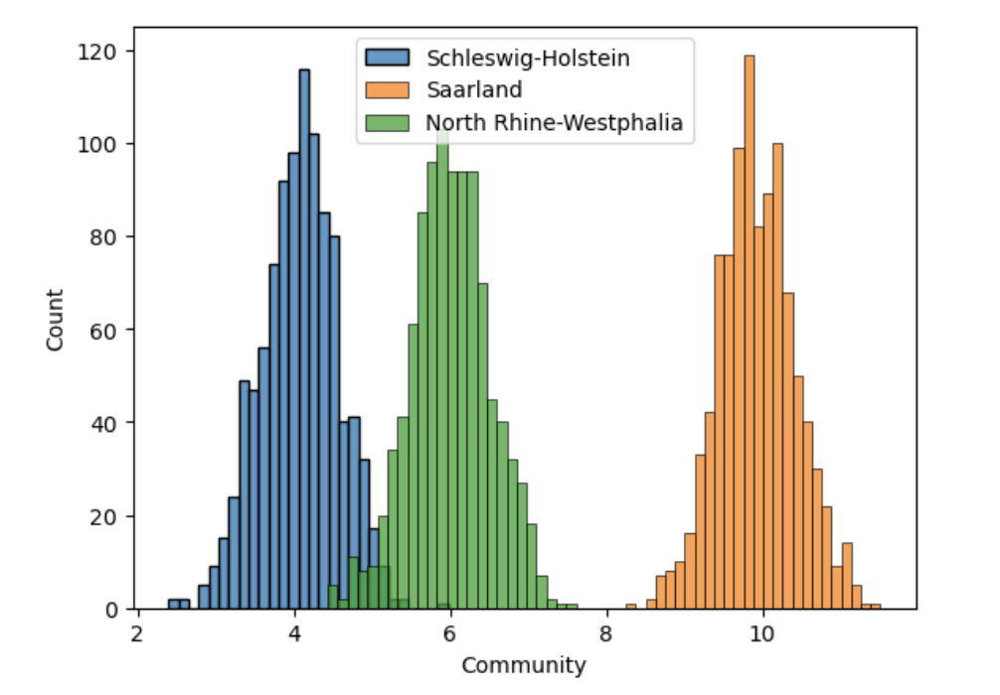
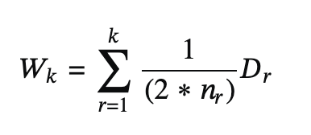
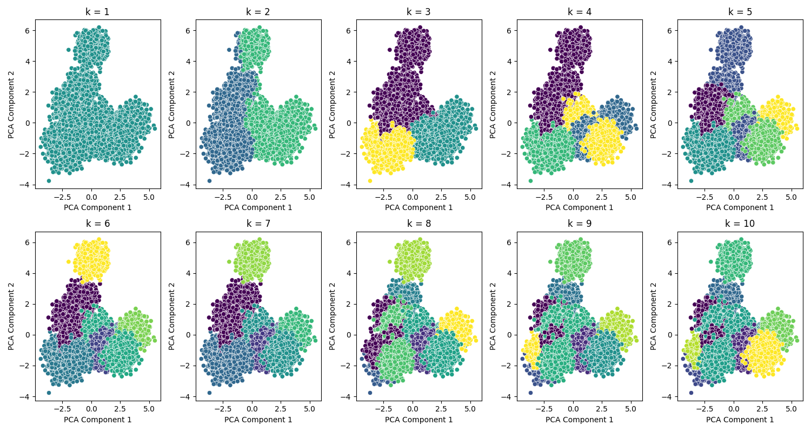
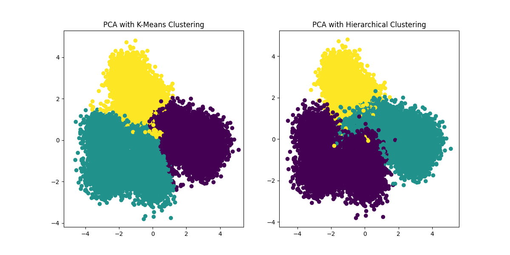
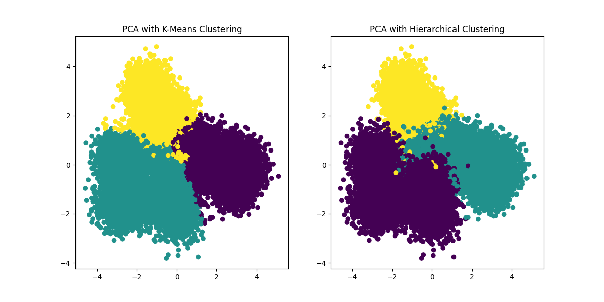
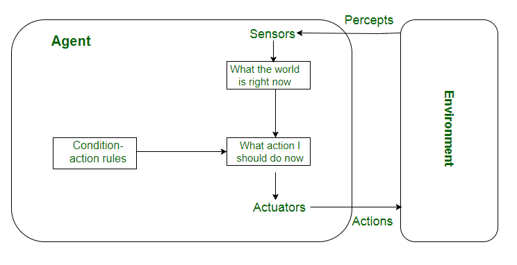

# Germany City+

## Motivation

Planning a trip to Germany but feeling overwhelmed by all the cities and states to choose from? Germany City+ is here to help! We understand that picking the perfect destination can be tough, so our goal is to make travel planning easier and enhance your experience in Germany. We know that every traveler is different, whether you're a student, a retiree, a professional, or a tourist, and we're here to cater to your unique interests and needs. Whether you're looking for educational opportunities, relaxation, work-related trips, or hidden gems to explore, Germany City+ has got you covered. Let us simplify your travel planning and guide you to the perfect destinations for your trip to Germany!

## Solutions

Our solution is a user-friendly Dash app designed to streamline travel planning and enhance your exploration of Germany. Through captivating visualizations, our app offers insights into the historical and contemporary differences between Western and Eastern Germany post-World War II across various aspects. Additionally, leveraging sophisticated machine learning model (KMean clustering), utilizing an effective AI agent, combination of RuleBased and LearningBased, our app provides personalized recommendations tailored to your trip's purpose and individual preferences. Whether you're seeking educational insights, leisurely pursuits, business opportunities, or off-the-beaten-path adventures, our recommendation system ensures that every traveler finds the perfect destinations to suit their needs. With Germany City+, embark on a journey of discovery and unlock the beauty and diversity of Germany with confidence and ease.

## Showcase

#### How to Run

- $ `git clone https://github.com/ANikfarjam/CS133Project.git`
- $ `cd CS133Project`
- $ `pip install requirements.txt`

Because we are importing modules from sibilings directory, we always have to run the home page as module by addin -m and not including .py

- $ `python3 -m Home`
- Open your browser of choice and go to `http://127.0.0.1:8050/` (Chrominum based preferred)

#### How to Stop

- `ctrl^C`

### Landing Page

### Geo Analysis

### State Analysis

### Recommendation System

!

### Recommendation Result

### Machine Learning

## Imlementation:
- ### Front End: 

For our UI we utilized Dash, an open-source Python framework for building analytical web applications. It is a powerful library that simplifies the development of data-driven applications.

Our app is consist of two components; a Navbar and a container. The elements on navbars returns URL, insted of calling another page. Based on what url has been returned, then our container renders related content based on selected topic.

- ### Data Collection:

Our data has been extracted from various recourses including we scraping techniques, due to avaiblity of concrete data. For visualization these data range from cities to states. How decided to choose states related data for ML training.

- ### Data Preparation and upscaling (R. Fernald):

We started started with data from COED Regional Well-Being Indicators, which collected data about various factors from Education and Jobs	to Civic engagement, Accessibility to services, and Life satisfaction. These ratings were on a scale of 10. The OECD data also came with data which had more specific features, such as percentages of people with specific levels of education, Employment  / Unemployment rate, Air pollution levels, and broadband access. For the purpose of our machine learning model we decided to use our ratings data to serve as a sort of classification metric. For our k-means clustering algorithm we knew we could get a more reliable and accurate model if we fed it more data. How ever the model we chose is a perfect fit for these type of data.

So we implemented a strategy of a bootstrap resampling method to generate more data points based on the minimal data we had. We managed to turn 15 rows with static data points, serving as averages for each respective category to a cloud of normally distributed data points around that mean. 

Essentially our resampling method takes the value of one cell, and generates a list of values normally distributed around that mean value, and adds that to the data. Repeating the same process across every row and down every column we were able to turn 15 rows of data into 15 thousand rows of data. Having an extra thousand data points was helpful and decisively smaller than we could have made it. Due to precautions of compute time for training our clustering algorithm, we decided that it was large enough. 

To verify that the data was normally distributed, I chose three States and looked at one of their factors, Community. After verifying this data was what I expected it to be I checked a few other factors and other states before I was satisfied with our bootstrap resampling.

### Machine Learning(A. Nikfarjam:)

- ### Intro:
K-Mean clustering is an unsupervised classification Model.  What sets it apart from supervised algorithms is the absence of a target variable. In unsupervised learning,the dataset only has input variables which describe the data. 

<video controls src="assets/KMeansClusteringAnimation.mp4" title="Title"></video>

In this model the clustering is done based on the distance from the centroid point.  The algorithm starts by randomly initializing centroids within the feature space. These centroids serve as the initial cluster centers. Due to the iterative nature of this model, these centerpoints are placed repeatedly and it returns the clusters with the equal variance minimizing a criterion known as the inertia or within-cluster sum-of-squares.

The value of K determines the number of clusters or more technically the number of the centroids. This value is the essence of this model. Beside over fitting or under fitting, If the value k is too small, clusters may be merged together, resulting in larger, less distinct clusters. In other hand, if 𝑘 is too large, there may be many small, tightly packed clusters that don't represent meaningful patterns in the data.

- ### Calculating value of K:

1- Visually: We can recursively increase the value of k and use our model to cluster them and use any visualization to plot all the clustered points in lower dimension. We can visually choose the one that has a disjoint set or clusters. However, visual calculation might not always be optimal. I

2- Use elbow method: It is based on the principle that as the number of clusters increases, the variance within each cluster decreases. However, at a certain point, adding more clusters does not significantly decrease the within-cluster variance, resulting in an "elbow" point in the plot of the within-cluster variance against the number of clusters. This elbow point indicates the optimal value of k where increasing the number of clusters beyond that point does not provide much better clustering. 

<video controls src="assets/ElbowPlot.mp4" title="Title"></video>

- ### Inertia
The "inertia" value in k-means clustering is a measure of how consistent clusters are. It quantifies the compactness of the clusters, with lower inertia indicating tighter clusters. Inertia is also referred to as within-cluster sum of squares (WCSS) or total within-cluster variance.
Mathematically, the inertia of a k-means clustering solution is calculated as the sum of squared distances of each data point to its nearest cluster centroid. It's computed using the following formula:

To apply these consepts into our project project, I detrmined the model perfomance with vaious number pf K. And 2 and 3 where both vere very apealing option.

Even though our module mathematically calculated the value of the optimal K = 2 but logically and by visual observation of the varius K value, it makes more sense to have 3 clusters. Also in graphicKmean.py I added a function to calculate inertia and apparently K has a better inertia if it is 3. That proves that our module should be clustered to 3.
Result of calculated innertias:

innertia of  1 value is:  390000.0

innertia of  2 value is:  344466.0142589376

innertia of  3 value is:  310816.5240798934

innertia of  4 value is:  289376.6697369555

innertia of  5 value is:  269282.434493601

innertia of  6 value is:  238208.79842850962

innertia of  7 value is:  219684.073000205

innertia of  8 value is:  198844.8285348383

innertia of  9 value is:  179801.22894743894

innertia of  10 value is:  162958.5462309094

- ### Model exploration:

To be able to recommend a good city or state, we needed to classify our data. The first step of the journey was to select a good model. At the beginning stage of data collection, we were considering using KNearest Neighbor KNN classification. But again since we are not defining any label the we decided to research and learn about unsupervised model, we explored K Mean Clustering vs Hierarchical Clustering.

K-Means Clustering: This algorithm partitions the data into K distinct clusters based on feature similarity. It's useful for identifying distinct groups within the data.

Hierarchical Clustering: This method builds a hierarchy of clusters either by a bottom-up approach or a top-down approach. It's beneficial for understanding the data structure and identifying hierarchical relationships between clusters.

Based on the description K-Mean clustering seemed more suitable because the recommendation was based on the similarities of the cities/states. Thus I made a script to compare the performance and ran it three times: once with 15000, once with 30000, and once with about 60000 data shape, this turns out to be our result. 

As it is noticeable we can see KM outperform Hiracial specially for a bigger data set. Another advantage was, since our data was upscaled, I have to use the data set with 60k data. After training and testing modules this is the result of clustered data. 

- ### Result of our Clustering:

### AI (A Nikfarjam)

Artificial intelligence referees to set of algorithms that performs based on three components of intelligence, Search, Reasoning, and representation. Since it knows all the possible solutions to the problem it uses the search, and reasoning (usually done by mathematical induction). In AI, an agent refers to an entity that perceives its environment through sensors and acts upon that environment through effectors.

There are many different types of agents that vary based on how they represent their world and how they make inferences based on the knowledge they know. For the purpose of our recommendation, we are using a combination of Rule Based and Learn Base Agent, which is a type of agent that uses a semantic network approach.

- ### Semantic Network

Semantic networks, on the other hand, are a knowledge representation technique used to organize and represent information in a network of interconnected concepts. In a semantic network, nodes represent concepts, and links between nodes represent semantic relationships such as "is-a," "part-of," or "related-to”. 

<video controls src="assets/SemanticNetworkAnimation.mp4" title="Title"></video>

- ### RuleBased Agent

There are many types of agents utilizing semantic network knowledge representation such as Logic Base and Rule Base agents. The major difference is how they represent their world and how they make inferences. Logic base uses process of logical inference to derive new representations about the world, and use these new representations to deduce what to do, and the world is represented in Conjunctive Normal Form. Rule Base however use simple if → then approach to make that inference and representation could vary. 

In our project the world is represented as DataFrames. After we classified the states, our agent collected data from the user(world), simply by prompting the user to fill up a form. Afterward the response gets passed to the agent in the form of an array list. An agent uses the responses and the knowledge it has from clustered states to make that deduction.  Since we are recommending a city, and the agent knows the information about the states, the next step for our agent is to extract all the cities from a state-city dictionary, and then use the collected data to make inferences and then return the list of matching cities that fits users' needs more.  

Referances:

ML Inspiration:
- https://towardsdatascience.com/understanding-k-means-clustering-in-machine-learning-6a6e67336aa1

 

## Meet Our Developers

- [Ashkan Nikfarjam](https://github.com/AshkanNikfarjam)
- [Ryan Fernald](https://github.com/ryanfernald)
- [Sean Hsieh](https://github.com/ShangchenHsieh)
